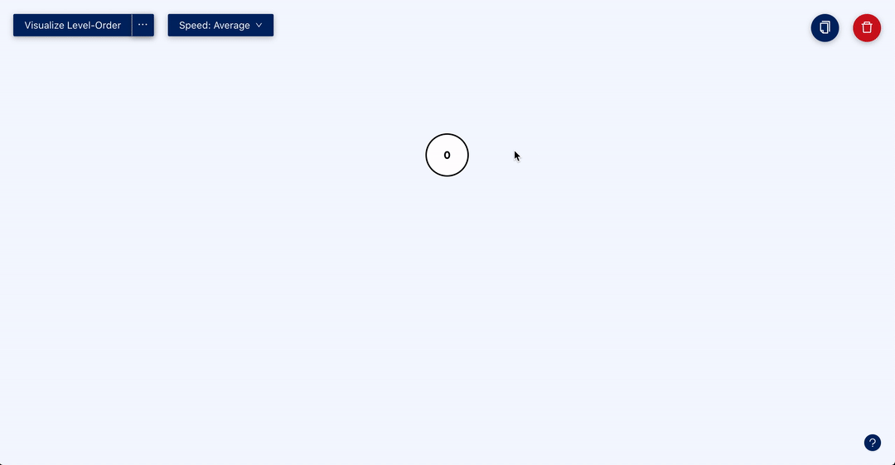

<h1 align="center">Tree Visualizer</h1>

  
  
  
  
  

> Tree Visualizer is an online platform for creating and customizing rooted binary trees and visualizing common tree traversal algorithms.

## ✨ Demo

Visit the platform at [tree-visualizer.netlify.app](https://tree-visualizer.netlify.app/).

  

## ✨ Features

- You can create and customize rooted binary trees.
- You can visualize common tree traversal algorithms.
- You can serialize the tree for [LeetCode](https://leetcode.com/problemset/all/) problems.

Give a ⭐️ if this project helped you!

## 🛠 Built With

- [React TypeScript](https://reactjs.org/) - Frontend
- [React D3 Tree](https://github.com/bkrem/react-d3-tree) - Visualization
- [Ant Design](https://ant.design/) - UI Library

## 🤝 Contributing

Contributions, issues, and feature requests are welcome! 

Feel free to check the [issues page](https://github.com/amndns/tree-visualizer/issues) for any open issues. If this is your first time contributing to Open Source, check out the [Contributing Guidelines](https://github.com/amndns/tree-visualizer/blob/master/CONTRIBUTING.md).

You can also suggest a new feature by creating an [issue](https://github.com/amndns/tree-visualizer/issues/new). Please wait for confirmation before working on it.

### Good for First Timers

- [ ] Add unit tests, integration tests, and end-to-end tests.
- [ ] Optimize tree traversal algorithms.
- [ ] Optimize serialization algorithm.

## 🚀 Get Started

This project was bootstrapped with [Create React App](https://github.com/facebook/create-react-app) and [TypeScript](https://www.typescriptlang.org/).

Below is a guide on the common commands you might use all throughout the development process. In the project directory, you can run:

### `yarn install`

Installs all package dependencies of the app. Make sure you have [yarn](https://yarnpkg.com/) installed and configured first.

### `yarn start`

Runs the app in development mode. Open [http://localhost:3000](http://localhost:3000) to view it in the browser. The page will reload if you make edits. You will also see any lint errors in the console.

### `yarn lint`

Launches the linter against all of the `.ts` and `.tsx` files from the `src/` directory. The project specifically uses [ESLint](https://eslint.org/) and [Prettier](https://prettier.io/) as the linter and code formatter, respectively.

### `yarn test`

Launches the test runner in interactive watch mode. See the section about [running tests](https://facebook.github.io/create-react-app/docs/running-tests) for more information.

## 📝 License

Copyright © 2020 [Adel Ismael Mandanas](https://github.com/amndns). 
This project is [MIT](https://github.com/amndns/tree-visualizer/blob/master/LICENSE) licensed.

***
_This README was generated with ❤️ by [readme-md-generator](https://github.com/kefranabg/readme-md-generator)_